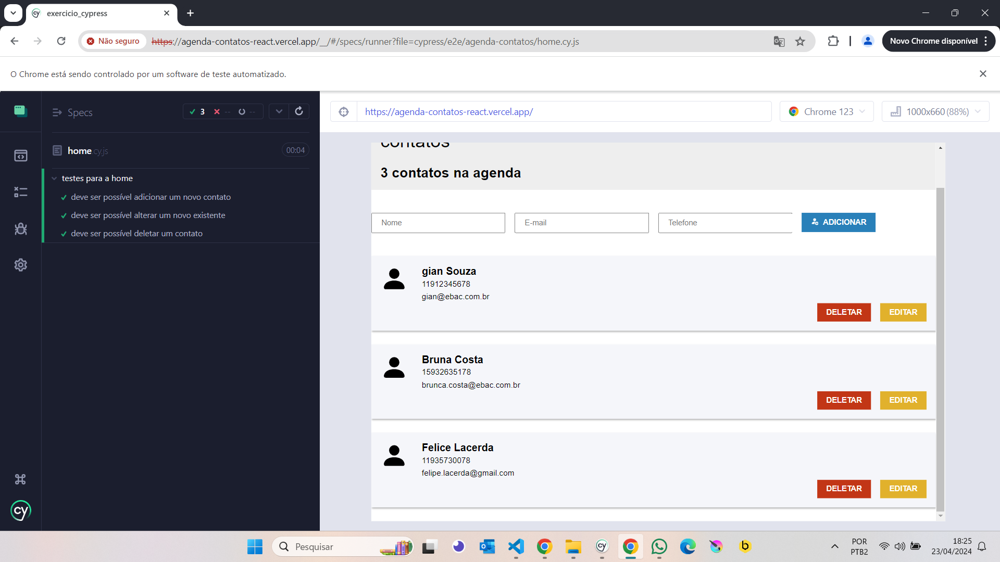
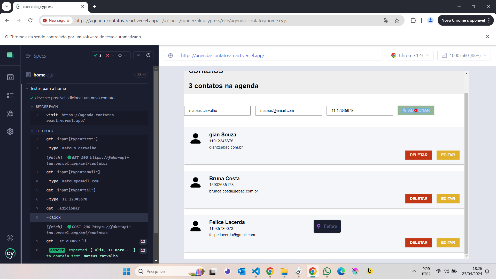
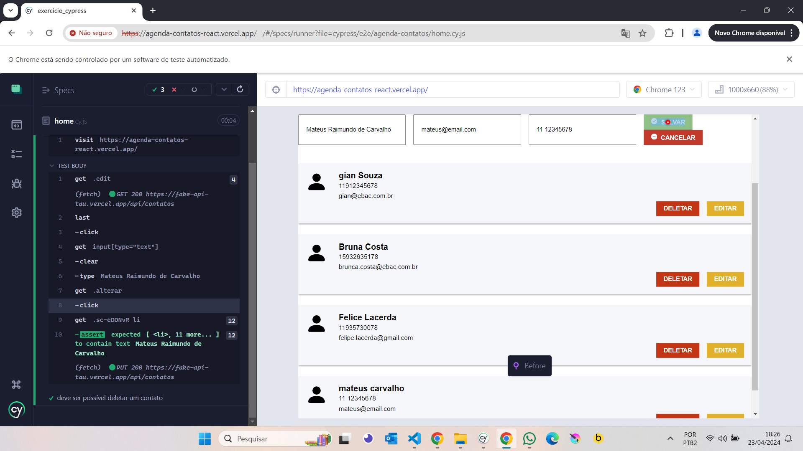
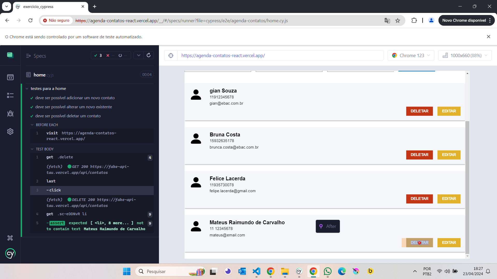

## Exercício sobre Cypress do curso Desenvolvedor Fullstack Java (EBAC)

- nesse exercício criamos testes para a seguinte aplicação: https://agenda-contatos-react.vercel.app/

- testamos a funcionalidade de criar, alterar e deletar um usuário

### Print abaixo mostra que os testes foram realizados com sucesso:

### Teste adicionando um novo usuário:

### Teste alterando usuário existente:

### Teste deletando usuário:

